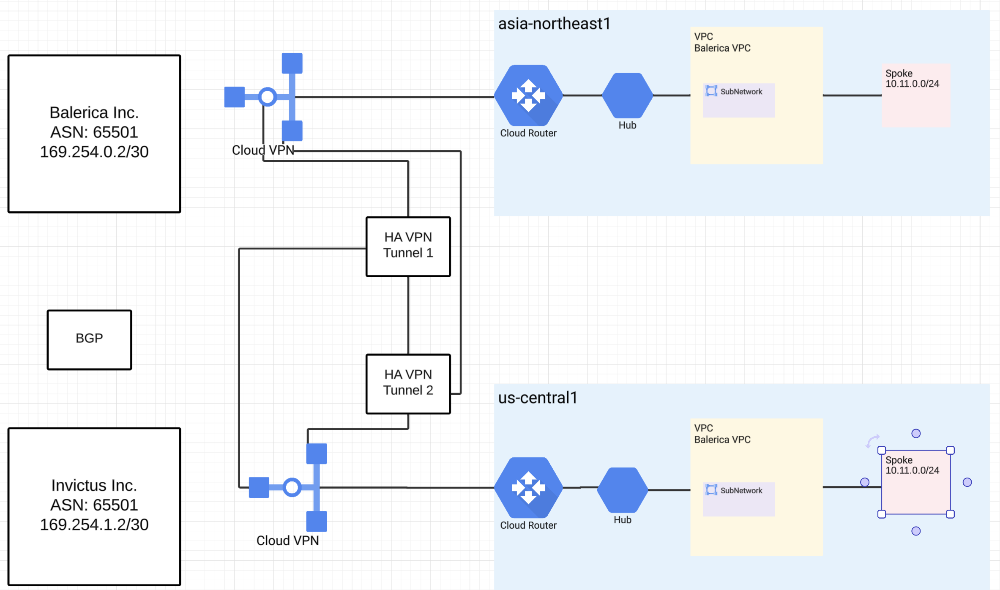
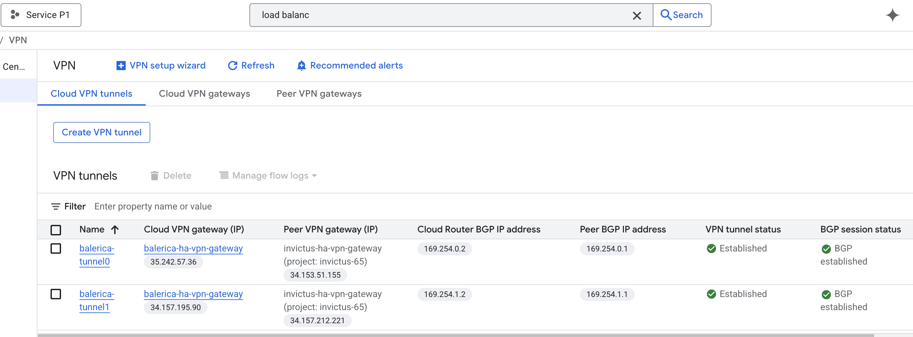
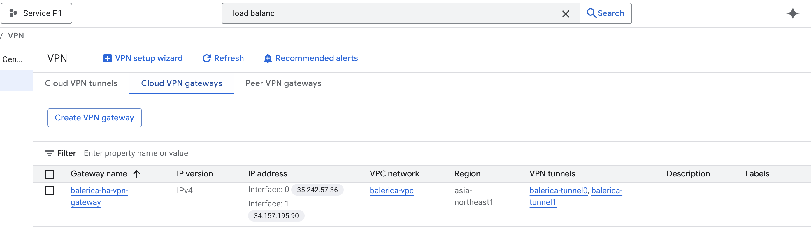
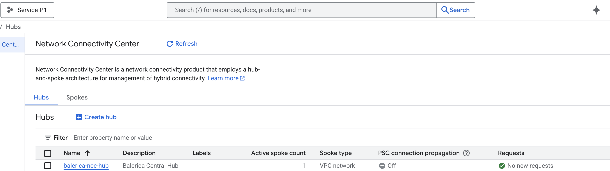
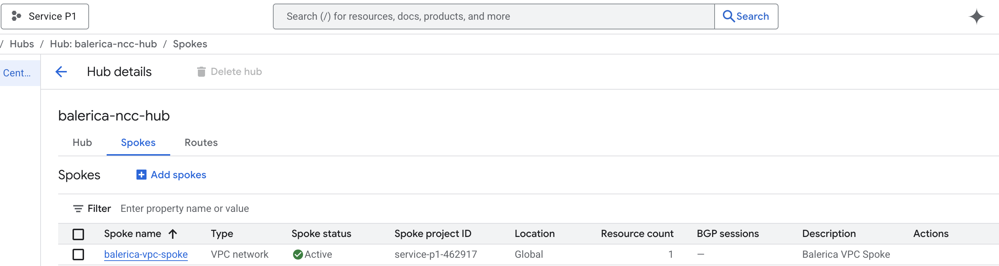
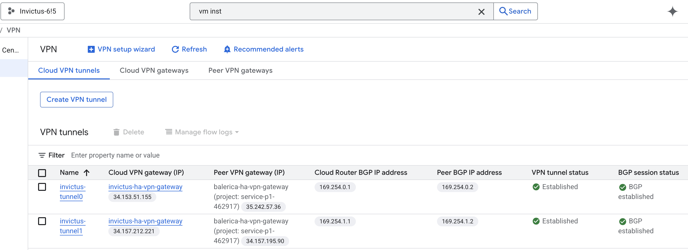
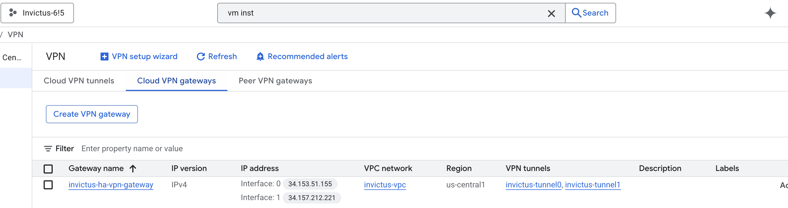
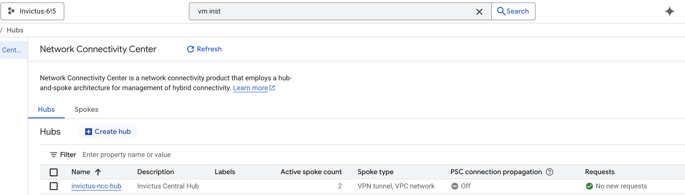
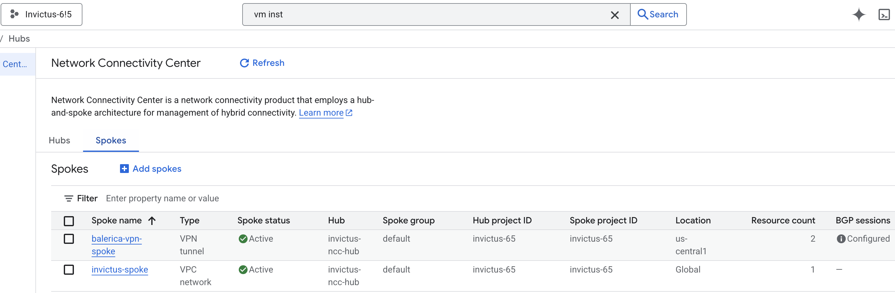

Diagram:
# Armageddon Task 1 - VPN Connection between Two GCP Projects

Project:
This task connects Balerica Inc. and Invictus Inc. for VPN connection. The connection is made via a VPN tunnel using Cloud Router and BGP to dynamically exchange routes between the two networks.
The project uses Terraform to automate the deployment of the necessary resources, including VPC networks, subnets, VPN gateways, Cloud Routers, and VPN tunnels.

Uses:
- Two of my own GCP Projects, in one account.
- Balerica Inc: "service-p1-462917" Project
- Invictus Inc: "invictus-65" Project

Structure:

Deployment:
1. 
2. 
3. 
4. 

Completion:
1. 
2. 
3. 
4. 
5. 
6. 
7. 
8. 

Teardown:
1.

Resources Used:
1. Visual Studio Code
2. Lucid Chart
3. github.com